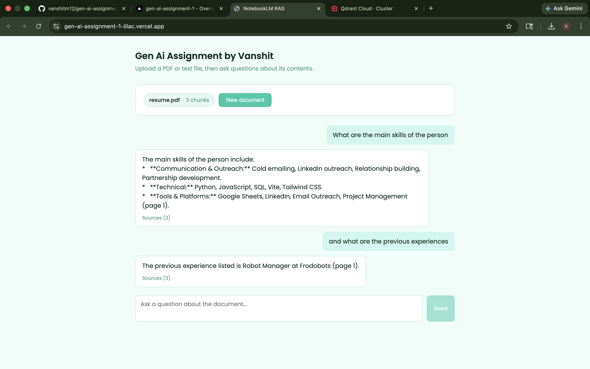

# NotebookLM RAG — AI-Powered Document Question Answering System

A lightweight clone of Google NotebookLM that allows users to upload PDF or text documents and ask questions grounded strictly in the uploaded content.

This project demonstrates a complete Corrective Retrieval-Augmented Generation (CRAG) pipeline using modern AI tools including Next.js, LangChain, Google Gemini, and Qdrant.

---

# Project Overview

Traditional LLMs may hallucinate or provide inaccurate responses. Basic RAG systems improve this by retrieving document chunks — but they blindly pass all retrieved chunks to the LLM, even irrelevant ones.

This project solves that problem using **Corrective RAG (CRAG)**, where every retrieved chunk is graded for relevance before being used to generate an answer. Only chunks that pass the relevance check are sent to Gemini — resulting in more accurate, grounded responses.

The application:
- Uploads and processes documents
- Splits content into semantic chunks
- Generates embeddings
- Stores embeddings in Qdrant Vector DB
- Retrieves relevant chunks for user queries
- **Grades each chunk for relevance using Gemini**
- **Filters out irrelevant chunks before generation**
- Generates grounded responses using Gemini

---

# Features

- Upload PDF and `.txt` files
- AI-powered document Q&A
- Semantic search using vector embeddings
- Context-aware answers
- Fast retrieval with Qdrant
- Modern UI with Next.js
- **Corrective RAG with per-chunk relevance grading**
- **Graceful fallback when no relevant chunks are found**
- Scalable architecture

---

# System Architecture

```text
                ┌────────────────────┐
                │   User Uploads     │
                │   PDF / TXT File   │
                └─────────┬──────────┘
                          │
                          ▼
                ┌────────────────────┐
                │   Document Loader  │
                │ PDFLoader / Text   │
                └─────────┬──────────┘
                          │
                          ▼
                ┌────────────────────┐
                │   Text Chunking    │
                │ Recursive Splitter │
                └─────────┬──────────┘
                          │
                          ▼
                ┌────────────────────┐
                │  Generate Embeds   │
                │ Gemini Embeddings  │
                └─────────┬──────────┘
                          │
                          ▼
                ┌────────────────────┐
                │ Store in Qdrant DB │
                │  Vector Database   │
                └─────────┬──────────┘
                          │
──────────────────────────────────────────────────────

                ┌────────────────────┐
                │   User Question    │
                └─────────┬──────────┘
                          │
                          ▼
                ┌────────────────────┐
                │   Query Embedding  │
                └─────────┬──────────┘
                          │
                          ▼
                ┌────────────────────┐
                │ Retrieve Top-K     │
                │ Chunks (Qdrant)    │
                └─────────┬──────────┘
                          │
                          ▼
                ┌────────────────────┐
                │  Grade Each Chunk  │  ◄── NEW (Corrective RAG)
                │  Gemini Grader     │
                └─────────┬──────────┘
                          │
               ┌──────────┴──────────┐
               ▼                     ▼
    ┌─────────────────┐   ┌─────────────────────┐
    │ Relevant Chunks │   │  No Relevant Chunks  │
    └────────┬────────┘   └──────────┬──────────┘
             │                       │
             ▼                       ▼
    ┌─────────────────┐   ┌─────────────────────┐
    │ Gemini 2.5 Flash│   │  Return: "Not found  │
    │ Generates Answer│   │   in document"       │
    └─────────────────┘   └─────────────────────┘
```

---

# Tech Stack

| Layer | Technology |
|---|---|
| Frontend | Next.js 14 |
| Language | TypeScript |
| LLM | Google Gemini 2.5 Flash |
| Embeddings | Gemini Embedding 001 |
| Vector Database | Qdrant Cloud |
| AI Framework | LangChain JS |
| Deployment | Vercel |

---

# Workflow

## 1. Document Upload
Users upload PDF or text files through the frontend interface.

## 2. Document Parsing
The system extracts text using:
- `PDFLoader` for PDFs
- Native parsing for `.txt` files

## 3. Text Chunking
Documents are divided into smaller overlapping chunks using `RecursiveCharacterTextSplitter`. This improves retrieval quality and embedding accuracy.

## 4. Embedding Generation
Each chunk is converted into vector embeddings using `gemini-embedding-001`.

## 5. Vector Storage
Embeddings are stored inside Qdrant Cloud for semantic similarity search.

## 6. Question Answering with Corrective RAG
When a user asks a question:
1. Query embedding is generated
2. Top-K chunks are retrieved from Qdrant
3. **Each chunk is graded as `relevant` or `irrelevant` by Gemini**
4. **Irrelevant chunks are filtered out**
5. **If no relevant chunks remain, the user is informed gracefully**
6. Gemini generates a grounded answer using only the relevant chunks

---

# Corrective RAG — How It Works

Standard RAG passes all retrieved chunks to the LLM regardless of quality. CRAG adds a grading layer:

| Scenario | Behaviour |
|---|---|
| All chunks relevant | Answer generated from all chunks |
| Some chunks irrelevant | Irrelevant chunks filtered out, answer from remainder |
| No relevant chunks found | Returns: *"I couldn't find relevant information in the document"* |

The grader uses the same Gemini model and prompts it to respond with only `"relevant"` or `"irrelevant"` for each chunk — keeping latency low by running all gradings in parallel.

---

# Folder Structure

```bash
project-root/
│
├── app/
│   └── api/
│       └── chat/
│           └── route.ts      # Query handler with Corrective RAG
├── lib/
│   └── rag.ts                # Embeddings, chunking, Qdrant config
├── public/
├── package.json
└── README.md
```

---

# Installation

## Clone the Repository

```bash
git clone https://github.com/vanshitm12/gen-ai-assignment-1.git
cd gen-ai-assignment-1
```

## Install Dependencies

```bash
npm install
```

## Setup Environment Variables

Create a `.env.local` file:

```env
GOOGLE_API_KEY=your_google_api_key
QDRANT_URL=your_qdrant_url
QDRANT_API_KEY=your_qdrant_api_key
```

## Run the Development Server

```bash
npm run dev
```

Application runs on `http://localhost:3000`

---

# Future Enhancements

- Multi-document querying
- Chat history and memory
- Citation references
- OCR support for scanned PDFs
- Streaming responses
- Authentication
- Hybrid search
- File summarisation
- Export chat conversations

---

# Learning Outcomes

This project helped in understanding:
- Retrieval-Augmented Generation (RAG)
- Corrective RAG and relevance grading
- Vector databases
- Embeddings and semantic search
- LangChain orchestration
- Prompt engineering
- AI application architecture
- Full-stack AI development
- Cloud deployment workflows

---

# Conclusion

NotebookLM RAG showcases how Large Language Models can be enhanced with corrective retrieval systems to create accurate, context-aware AI applications. The addition of Corrective RAG ensures that only high-quality, relevant context reaches the LLM — reducing hallucinations and improving answer precision.

---

## Example

